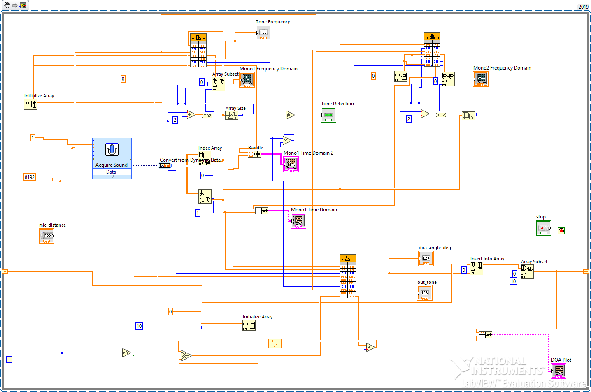

## Tone Detection and DOA Estimation

This project implements real-time tone detection and direction-of-arrival (DOA) estimation using the C language. It is designed for integration with LabVIEW via DLLs.

## 🔧 Features
- Custom FFT implementation (Cooley-Tukey Radix-2 DIT)
- CFAR based tone detection algorithm
- Phase-difference DOA estimation from two microphone signals
- Rolling buffer of last 10 DOA angle results for LabVIEW plotting

## 📁 Files
- `tone_detector.c` – Main source file containing FFT, CFAR, and DOA functions
- `tone_detector.h` – Header file 
- `vii.png` – LabVIEW block diagram screenshot
- 

## 📌 Usage
1. Compile `tone_detector.c` into a DLL using LabWindows/CVI or compatible C compiler.
2. In LabVIEW, use "Call Library Function Node" to call `ProcessAudio` or `EstimateDOA`.

## 🧠 Function Descriptions
### `ProcessAudio(...)`
Detects tone frequency in mono signal using FFT and CFAR.

### `EstimateDOA(...)`
Calculates DOA angle using phase difference at the tone frequency bin between two microphone signals.
